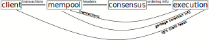

# Engines

Anoma's implementation is structured as a set of communication _engines_. An _engine_ can be understood as a deterministic logical process operating within a trusted domain, and can be characterised as a function, parameterised over a state type, input message type, and output message type, taking a tuple of the current state and a set of input messages, and returning a tuple of a new state and a set of output messages. 

```haskell
type Engine State InMsg OutMsg = (State, Set InMsg) -> (State, Set OutMsg)
```

This interface is _compositional_, where two engines can be combined by routing specific messages to and from each other, to form a third engine which is a specific composition of the two.

> TODO: Specify this further.

Structuring the implementation as a composition of engines has many benefits:
- A clean separation of concerns between different areas of concern in the protocol (e.g. network layer interfacing, consensus message processing, signature generation).
- Easier upgrades, as engine implementations can be independently upgraded as long as interface properties (at the level of the engine function as above) are still satisfied.
- The possibility of hot reloading. Typiucally, engines can be hot reloaded as long as interface properties are still satisfied and state is appropriately transferred - messages are just queued.
- Different engines can be property tested and formally verified independently, since they have independently articulated properties. Testing and verification of engine compositions can build on these efforts.
- A natural mapping to separate physical processors or machines. Engines are assumed to operate within a single trust domain, but can otherwise be separated and run in parallel, in the form of separate cores on the same physical machine, multiple physical machines across a network boundary, etc.

Important notes:
- Engines are _logical_ processes, not physical ones. Any mapping of logical to physical processes is possible as long as the logical properties are adhered to.

Engines:
- [P2P](./engines/p2p.md)
- [Mempool](./engines/mempool.md)
- [Consensus](./engines/consensus.md)
- [Execution](./engines/execution.md)
- [Storage](./engines/storage.md)
- [Compute](./engines/compute.md)
- [Solver](./engines/solver.md)
- [Identity](./engines/identity.md)
- [Strategy synthesis](./engines/strategy-synthesis.md)
- [Interaction](./engines/interaction.md)

---

note: typhon and taiga


## Summary
Typhon stores, orders, and executes transactions on Anoma blockchains. 
It is intended as a replacement for [Tendermint](https://tendermint.com/core/).
[We have a brief overview presentation of some of the features of Typhon here](https://youtu.be/n4MlYO_ls4M?t=7687).

Typhon can be broken down into three engines:
- a [mempool](engines/mempool.md), which receives transaction requests and stores them
- a [consensus](engines/consensus.md), which orders transaction requests collected by the mempool, and
- an [execution engine](engines/execution.md), which executes the transactions on the state machine.

We expect each Anoma participant (*validator*) will run processes for all three engines.

Above, a _client_ can be a [solver](engines/solver.md), ferveo, or anyone else who generates transactions to be ordered.
The critical path of the protocol is shown in thicker arrows, with other crucial messages shown in narrower arrows.


## [Mempool](engines/mempool.md)
Validators receive transactions from clients, store them, and make them available for the [execution engine](engines/execution.md) to read.
The mempool protocol, which is based on [Narwhal](https://arxiv.org/abs/2105.11827) also produces a [DAG](https://en.wikipedia.org/wiki/Directed_acyclic_graph) of *headers*, which reference batches of transactions (via hash), and contain certificates of availability of transaction data.
These headers are ultimately what the [consensus](engines/consensus.md) decides on, in order to establish a total order of transactions for the [execution engine](engines/execution.md).
[Read more here.](engines/mempool.md)
## [Consensus](engines/consensus.md)
Our consensus is based on [Heterogeneous Paxos](https://arxiv.org/abs/2011.08253).
Validators choose a totally ordered sequence of headers from the [mempool](engines/mempool.md) DAG.
This establishes a total order of transactions for the [execution engine](engines/execution.md) to execute.
[Read more here.](engines/consensus.md)
## [Execution Engine](engines/execution.md)
Given a total order of transactions, the [execution engine](engines/execution.md) updates and stores the "current" state , using as much concurrency as possible.
Proofs from the execution engine allow light clients to read the current state.
When the execution engine has processed a transaction, it communicates to the [mempool](engines/mempool.md) that the transaction can data can be garbage-collected from storage.
[Read more here.](engines/execution.md)
