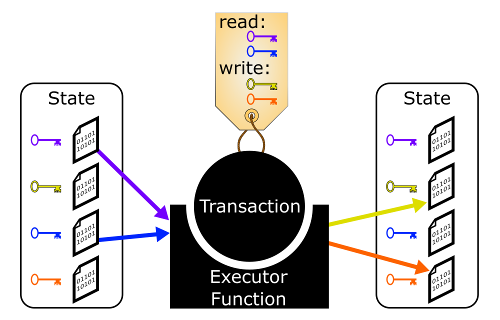

# Execution

Inputs:
- transactions (from [Mempool](mempool.md))
- partial transaction ordering information (from [Mempool](mempool.md))
- total transaction ordering information (from [Consensus](consensus.md))

Outputs:
- execution results, including state reads (for clients)
- garbage collection information (for [Mempool](mempool.md))

Preferences: ?

Accounting: executions actually performed, parallelization (perhaps)

---

# Execution Engine
## Summary
Given a total order (from the [consensus](consensus.md)) of transactions (from the [mempool](mempool.md)), the execution engine updates and stores the "current" state of the [replicated state machine](https://en.wikipedia.org/wiki/State_machine_replication), using as much concurrency as possible.
Outputs from the execution engine allow light clients to read the current state.
When the execution engine has finished with a transaction, it communicates to the [mempool](mempool.md) that the transaction can be garbage-collected from storage.

## State
State is stored as mutable *Data* (unlimited size blobs of binary), each of which is identified with an immutable *Key*.
If you want to mutate a Key associated with specific Data, that's equivalent to deleting the Data associated with the old Key, and writing it to the new Key.
Keys that have never had Data written to them are mapped to an empty value.

Keys can have structure.
For example, we can arrange them in a forest, to allow us to easily express sub-trees using prefixes.
This would allow labels to express potentially infinite sets of keys in a compact way.
This makes Re-Sharding challenging.

## State Machine API

### Transaction Labels

For each Learner, transactions are *labeled* with a set of keys they can read, and a set of keys they can write.

$read :  \left\langle Learner, Transaction \right\rangle \rightarrow \left\{Key\right\}$

$write : \left\langle Learner, Transaction \right\rangle \rightarrow \left\{Key\right\}$

### Executor Function

In order to define a state machine for use with Typhon, we require an *Executor Function*:

$executor\_function : \left\langle\left(Key \rightarrow Data\right), Transaction\right\rangle \rightarrow \left( \left\{\left\langle Key , Data \right\rangle\right\}, IO \right)$

Inputs:
- the previous state, represented as a function from Keys to Data
- the Transaction text itself

Outputs:
- the new $\left\langle Key, Data\right\rangle$ pairs to be written to state.
  - Naively, these must include all the Keys in $write(L,T)$, but perhaps we can make a special optimization for "don't actually update this Key," even if we can only do it for keys in $read(L,T)\cap write(L,T)$.
  - This new state must be a deterministic result of the inputs
- Some IO side-effects, including sending messages to clients or whatever.

## Execution Engine Architecture
Our architecture is heavily inspired by [Calvin: Fast Distributed Transactions for Partitioned Database Systems](http://cs.yale.edu/homes/thomson/publications/calvin-sigmod12.pdf).
It facilitates concurrency while maintaining [serializability](https://en.wikipedia.org/wiki/Serializability) using the [mempool](mempool.md) and [consensus](consensus.md) components as a sequencer.

### Timestamps
Each Transaction has a *Timestamp* which conveys ordering information relative to other transactions.
Timestamps, and thus transactions, are partially ordered.
As shards learn more information from [consensus](consensus.md) or the [mempool](mempool.md), they are able to refine this partial order until it is a total order.
For [Heterogeneous Narwhal](mempool.md), these timestamps may be tuples of $\left\langle validator\_id, block\_header\_height, transaction\_hash\right\rangle$

### Shards
*Shards* are processes that store and update state.
Different shards may be on different machines. Redistributing state between shards is called *Re-Sharding*.
Each Shard is specific to 1 learner.
However, as an optimization, an implementation could conceivably use 1 process to do the work of multiple shards with different learners so long as those shards are identical, and fork that process if / when the learners diverge.

For each Key, each Shard maintains a (partially-ordered) timeline of Timestamps of Transactions that read or write to that Key.
Shards also store the data written by each transaction that writes to that Key.
This is [multi-version concurrent storage](https://en.wikipedia.org/wiki/Multiversion_concurrency_control).

### Executor Processes
*Executor Processes* are processes that actually run the Executor Function and compute updates.
Executor Processes can be co-located with shards.
The Execution Engine might keep a pool of Executor Processes, or spin a new one up with each transaction.

### Life of a Transaction

- When the [mempool](mempool.md) stores a transaction, the execution engine assigns an executor process, using that transaction's text.
- Once the [mempool](mempool.md) has assigned a timestamp to a transaction, it communicates that timestamp to each of the shards in the transaction's label, and establishes communication channels between the shards and teh transaction's executor process.
Each shard then stores that timestamp in its timeline.
- For each key read, when the relevant Shard learns the precise data to be read at that time (identifies a unique previous transaction and learns the data written by that transaction), it communicates that data to the Executor process.
  - As an optimization, we may want to allow "lazy" reads
- When it receives all the data it needs to read, the executor process runs the executor function in order to learn the values written.
  It then communicates these values to the relevant shards.
  - As an optimization, we may allow executor processes to start computing before all reads are available, if possible.
  - As an optimization, we may consider special writes such as "don't change this data," (which would only work for keys the transaction both reads and writes)
- For each key written, the shard waits to receive data written from the executor process, and stores it.

## Serializable Transaction Execution
We want to *execute* each transaction (evaluate the executor function in order to compute the data written) while preserving [serializability](https://en.wikipedia.org/wiki/Serializability): each transaction's reads and writes should be *as if* the transactions were executed in the order determined by [consensus](consensus.md).
We can imagine the simplest system as executing each transaction, after they're ordered by [consensus](consensus.md), sequentially, using the executor function.
However, we want to compute concurrently as possible, for minimum latency.
We do this using a set of optimizaitons.

### Optimization: Per-Key Ordering

  <table>
    <tr>
      <td>
        
      </td>
      <td>
        <object width=500 data="keys_animated.svg" type="image/svg+xml">
        </object>
      </td>
    </tr>
  </table>

[Mempool](mempool.md) and [consensus](consensus.md) provide ordering information for the timestamps, so within each key, transactions can be totally ordered by a "Happens Before" relationship.
With a total ordering of transactions, keys can send read information to executors as soon as the previous transaction is complete.
However, transactions that don't touch the same keys can be run simultaneously.
In the diagram above, for example, transactions `c` and `d` can run concurrently, as can transactions `e` and `f`, and transactions `h` and `j`.

### Optimization: Order With Respect To Writes

  <table>
    <tr>
      <td>
        
      </td>
      <td>
        <object width=500 data="only_order_wrt_writes_animated.svg" type="image/svg+xml">
        </object>
      </td>
    </tr>
  </table>

In fact, shards can send read information to an executor process as soon as the previous write has completed.
All shards really need to keep track of is a total order of writes, and how each read is ordered with respect to writes (which write it happens before and which write happens before it).
As soon as the preceding write is complete, the reads that depend on it can run concurrently.
There are no "read/read" conflicts.
In the diagram above, for example, transactions `a` and `b` can run concurrently.

### Optimization: Only Wait to Read

  <table>
    <tr>
      <td>
        
      </td>
      <td>
        <object width=500 data="only_wait_to_read_animated.svg" type="image/svg+xml">
        </object>
      </td>
    </tr>
  </table>

Because we store each version written ([multi-version concurrent storage]), we do not have to execute writes in order.
A shard does not have to wait to write a later data version to a key just because previous reads have not finished executing yet.
In the diagram above, for example, only green "Happens Before" arrows require waiting.
Transactions `a`, `b`, `c`, and `j` can all be executed concurrently, as can transactions `d`, `e`, and `i`.

### Optimization: Execute With Partial Order
Some [mempools, including Narwhal](mempool.md) can provide partial order information on transactions even before consensus has determined a total order.
This allows Typhon to execute some transactions before a total ordering is known.
In general, for a given key, a shard can send read information to an executor when it knows precisely which write happens most recently before the read, and that write has executed.

#### heardAllWrites

In order to known which write happens most recently before a given read, Typhon must know that no further writes will be added to the timeline before the read.
[Mempool](mempool.md) and [consensus](consensus.md) should communicate a lower bound timestamp to the execution engine, called $heardAllWrites$, before which no more transactions containing any write operations will be sent to the execution engine.
This can be on a per-key basis or simply a global lower bound.
Occasionally, $heardAllWrites$ should be updated with later timestamps.
Each round of consensus should produce a lower bound for $heardAllWrites$, but the [mempool](mempool.md) may already have sent better bounds.
Each Shard must keep track of $heardAllWrites$ on each key's multi-version timeline.

Transactions (like transaction `j` in the diagram below) containing only write operations can execute with a timestamp after $heardAllWrites$, but this simply means calculating the data they will write.
Since that doesn't depend on state, this can of course be done at any time.

#### heardAllReads

We want to allow Typhon to eventually garbage-collect old state.
[Mempool](mempool.md) and [consensus](consensus.md) should communicate a lower bound timestamp to the execution engine, called $heardAllReads$, before which there will be no more read transactions send to the execution engine.
Occasionally, $heardAllReads$ should be updated with later timestamps.
Each Shard must keep track of $heardAllReads$ on each key's multi-version timeline, so it can garbage collect old values.

  <table>
    <tr>
      <td>
        
      </td>
      <td>
        <object width=500 data="execute_before_consensus_animated.svg" type="image/svg+xml">
        </object>
      </td>
    </tr>
  </table>

In the example above, our "Happens Before" arrows have been replaced with "May Happen Before" arrows, representing partial ordering information from the [mempool](mempool.md).
Note that not all transactions can be executed with this partial order information.

#### Conflicts
There are 3 types of conflicts that can prevent a transaction from being executable without more ordering information.
- *Write/Write Conflicts* occur when a shard cannot identify the most recent write before a given read.
  In the diagram above, transaction `e` cannot execute because it's not clear whether transaction `b` or transaction `c` wrote most recently to the yellow key.
- *Read/Write Conflicts* occur when  shard cannot identify whether a read operation occurs before or after a write, so it's not clear if it should read the value from that write or from a previous write.
  In the diagram above, transaction `g` cannot execute because it's not clear whether it would read the data written to the blue key by transaction `d` or transaction `i`.
- *Transitive Conflicts* occur when a shard cannot get the data for a read because the relevant write is conflicted.
  In the diagram above, transaction `h` cannot execute because it cannot read the data written to the yellow key by transaction `g`, since transaction `g` is conflicted.
As the [mempool](mempool.md) and [consensus](consensus.md) provide the execution engine with more and more ordering information, and the partial order of timestamps is refined, all conflicts eventually resolve.
In the diagram above, suppose consensus orders transaction `g` before transaction `i`.
The Read/Write conflict is resolved: transaction `g` reads the data transaction `d` writes to the blue key.
Then the transitive conflict is also resolved: transaction `h` will be able to execute.

### Optimization: Client Reads as Read-Only Transactions

  <table>
    <tr>
      <td>
        
      </td>
      <td>
        <object width=500 data="read_only_animted.svg" type="image/svg+xml">
        </object>
      </td>
    </tr>
  </table>

With the above optimizations, transactions containing only read operations do not affect other transactions (or scheduling) at all.
Therefore, they can bypass [mempool](mempool.md) and [consensus](consensus.md) altogether.
Clients can simply send read-only transactions directly to the execution engine (with a label and a timestamp), and if the timestamp is after $heardAllReads$, the execution engine can simply place the transaction in the timeline of the relevant shards and execute it when possible.
In the diagram above, transaction `f` is read-only.

If client reads produce signed responses, then signed responses from a weak quorum of validators would form a *light client proof*.
