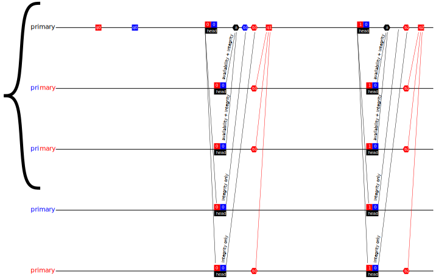
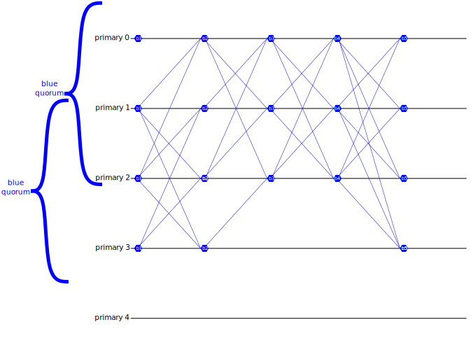
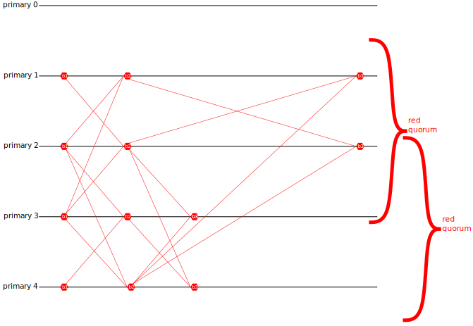
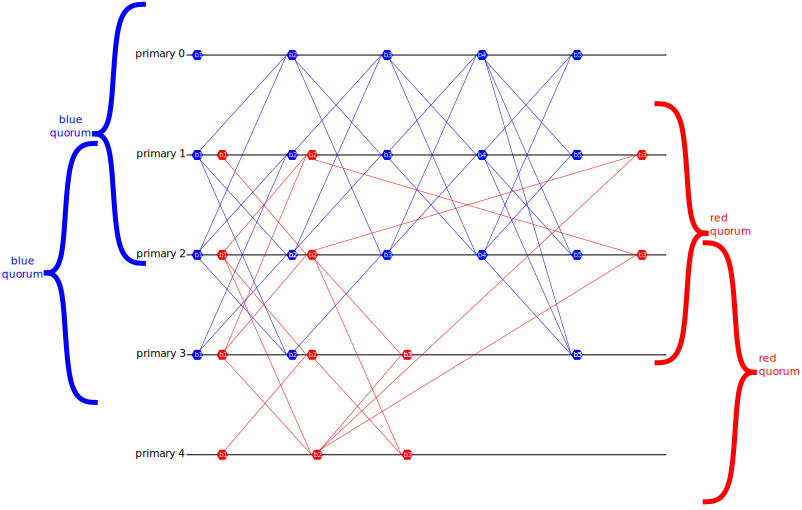
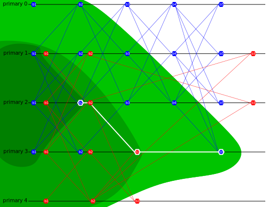

# Mempool
## Summary
Validators run the mempool protocol.
They receive transactions from clients, store them, and make them available for the [execution engine](execution.md#execution-engine) to read.
The mempool protocol, which is based on [Narwhal](https://arxiv.org/abs/2105.11827) also produces a [DAG](https://en.wikipedia.org/wiki/Directed_acyclic_graph) of _headers_, which reference batches of transactions (via hash), and prove that those transactions are available for the [execution engine](execution.md#execution-engine).
These headers are ultimately what the [consensus](consensus.md#consensus) decides on, in order to establish a total order of transactions.

## Heterogeneous Narwhal
The core idea here is that we run an instance of Narwhal for each learner.
For chimera chains, an "atomic batch" of transactions can be stored in any involved learner's Narwhal. 

We also make 2 key changes:

- The availability proofs must show that any transaction is sufficiently available for all learners.
This should not be a problem, since in Heterogeneous Paxos, for any connected learner graph, any learner's quorum is a weak quorum for all learners. 
- Whenever a validator's Narwhal primary produces a batch, it must link in that batch not only to a quorum of that learner's block headers from the prior round, but also to the most recent batch this validator has produced _for any learner_.
This ensures that, within a finite number of rounds (3, I think), any transaction batch referenced by a weak quorum of batches in its own Narwhal will be (transitively) referenced by all batches in all Narwhals for entangled learners.
### Overview
Like [Narwhal](https://arxiv.org/abs/2105.11827), Heterogeneous Narwhal Validators have multiple concurrent processes (which can even run on separate machines).
Each validator has one _primary_ process and many _worker_ processes.
When a client submits a transaction, they first send it to a worker process.

#### Workers
Worker processes ensure transactions are available.
Transactions are batched, and erasure-coded (possibly simply replicated) across a _weak quorum for every learner_ of workers, and only signed hashes of those batches are sent to primaries.
This separates the high-bandwidth work of replicating transactions from the ordering work of the primaries. 

#### Primaries
Primary processes establish a partial order of transaction batches (and by extension transactions), in the form of a structured DAG.
The DAG proceeds in _rounds_ for each learner: each primary produces at most one block for each (correct) learner in each round.
That block references blocks from prior rounds. 

Primaries assemble headers (both their own and for other primaries) from collections of worker hashes, and references to prior blocks.
They then sign votes, stating that they will not vote for conflicting headers, and (optionally) that their workers have indeed stored the referenced transactions.
Primaries collect votes concerning their own headers, producing blocks: aggregated signatures showing a header is unique. 

More formally, we present the Heterogeneous Narwhal protocol as the composition of two crucial pieces: the Heterogeneous Narwhal Availability protocol, and the Heterogeneous Narwhal Integrity protocol. 

### Vocabulary
- _Learner_s dictate trust decisions: just like in Heterogeneous Paxos, we use a Learner Graph. In diagrams, we usually represent learners with colors (red and blue).
-  _Quorum_: a set of validators sufficient for a Learner to make blocks. Each Learner has a set of quorums.
- _Intact Learner_: any 2 quorums for an Intact Learner have a correct validator in their intersection. Most of our guarantees apply only to Intact Learners.
- _Entangled Learners_: a pair of learners _A_ and _B_ are entangled if, for any quorum _Qa_ of _A_, and any quorum _Qb_ of _B_, the intersection of _Qa_ and _Qb_ contains a correct validator.
Some guarantees apply pairwise to Entangled Learners: they are, in a sense, guaranteed to agree on stuff. 
-  _Weak Quorum_: a set of validators that intersects every quorum. Weak Quorums are Learner-specific, so when we say _weak quorum for every learner_ we mean a set of validators that intersects every quorum of every Learner. 
-  _Transaction_: data from clients to be ordered. We do not specify how it's formatted. 
- _Batch_: a set of transactions collected by a Worker.
-  _Erasure Share_: data transmitted to a weak quorum of listening workers, such that any Quorum of validators can re-construct the original data (Transaction or Batch of Transactions).
-  _Worker Hash_: a signed digest of a batch of transactions collected by (and signed) by a worker.
-  _Header_s have:
    - an associated Primary (who "created" this header)
    - a set of Worker Hashes (from workers on the same validator as this primary)
    - an Availability Certificate for the previous Header issued by this primary
    - at most one Signed Quorum for each Learner
-  _Availability Certificate_: an aggregation of signatures from a Weak Quorum attesting that everything referenced by a particular Header is available. Must include a signature from the Header's primary. 
-  _Block_: an aggregation of Header signatures from a quorum of a specific learner attesting that they will not attest to any conflicting header. Also includes an Availability Certificate. Should include all signatures a primary has gathered for that header at the time (signatures in the Availability Certificate count).
-  _Signed Quorum_: a quorum of blocks with the same learner and round, signed by a primary. These are referenced in headers.

## Heterogeneous Narwhal Availability Protocol

### Batches and Worker Hashes
When a worker has collected a batch of transactions, it transmits erasure shares (possibly full copies) of those transactions to other workers on a _weak quorum for every learner_ of validators.
What's important about this erasure coding is that any Quorum of any Learner can reconstruct every transaction.
Furthermore, workers must be able to verify that they are in fact storing the correct Erasure Share of the data referenced in the Worker Hash.
One way to accomplish this is to transmit a complete copy of all the data to an entire Weak Quorum for every Learner. 

In fact, rather than wait until a batch is complete to start transmitting, workers can stream erasure shares as they receive transactions.
When it has completed a batch, a worker also transmits a signed _Worker Hash_ to those other workers, and its own primary.
We do not specify when workers should complete batches, but perhaps it should be after some timeout, or perhaps primaries should signal workers to complete batches. Batches should not be empty. 

### Signed Quorums and Headers
Primaries ultimately produce blocks for each round, for each Learner, and send those blocks to other Primaries.
When a primary for validator `V` has received blocks for learner `L` and round `R` from an entire quorum of validators for learner `L`, it signs that collection, producing a _Signed Quorum_ object, which identifies the validator `V`, the learner `L`, and the round `R`.
The Signed Quorum is then broadcast (or erasure coded) to primaries on a _weak quorum for every learner_ of validators.
Much like batches, it is important that any Quorum for any Learner can re-construct the entire Signed Quorum. 

Periodically, each primary `P` produces _Headers_.
Each Header contains:

- a set of signed Worker Hashes, all signed by `P` 's validator
- a hash referencing at most one Signed Quorum per Learner, all signed by `P` 
- an _Availability Certificate_ (we'll get to how those are made shortly) for the previous Header `P`  issued.
Headers should be relatively small.
Each primary then sends the header to all the other primaries.
When a Primary receives a Header, it can produce an _Availability Vote_ (which is a digital signature) iff

- the primary has stored its share of all Signed Quorums referenced,
- the primary has received messages from its workers indicating that they have stored their shares of all the Batches referenced
The Availability Votes are then transmitted to the Header's Primary.
When a primary receives Availability Votes for a Header from a weak quorum for every learner, it can aggregate those signatures to produce an _Availability Certificate_, which proves that the Header (and its contents) are available to any Quorum.
Availability Certificates should be small.
Note that, if primaries broadcast Availability Certificates as soon as they produce them, other primaries may have all the components necessary to "receive" a Header even before the Header's Primary actually sends it.
Specifically, they may have:

- Signed Batch Headers from their listening Workers
- Signed Quorum shares received earlier from the Primary
- Availability Certificate received earlier from the Primary
## Heterogeneous Narwhal Integrity Protocol

For each Header it produces, a Primary can calculate its _Learner Vector_: this represents, for each Learner, the highest round number of any quorum referenced in this Header or its ancestors (its predecessor, of its predecessor's predecessor, etc.).
If, for some Learner `L`, a header `H` has a greater round number `R` in its _Learner Vector_ for `L` than did `H`'s predecessor, then the Primary can produce a _Block_ for learner `R` and round `L`.
Intuitively, a Primary produces a block whenever it gets a quorum for a Learner in a latest round. 

A block for learner `L` includes an Availability Certificate, as well as an aggregated signature formed from the Integrity Votes of (at least) a quorum (for learner `L`) for the same Header.
Blocks are transmitted to all other Primaries, who use them to form Signed Quorums. 

If a Primary uses the same Header to make blocks for multiple Learners, each block it produces must use a superset of signatures as the previous. This ensures that if the Primary produces a block for Learner A and then a block for learner B, the Block for learner B effectively includes the block for learner A.
We can use this when we later establish a total ordering: any reference to the learner B block also effectively references the learner A block. 

## DAG Properties

Note that blocks reference a quorum of blocks from the previous round.
This does not require that the same primary produced a block for the previous round.
In round 5, Primary 3 can produce a block if it has received a quorum of round 4 blocks from other Primaries. 

Furthermore, rounds of different learners are not totally ordered.
Red round 3 cannot really be said to happen before, or after, blue round 4. 

### Fair Broadcast
In Homogeneous Narwhal, any block which is referenced by a weak quorum in the following round will be (transitively) referenced by all blocks thereafter. Heterogeneous Narwhal has analogous guarantees:

#### Any block for learner `A` referenced by a weak quorum for learner `A` will, after 3 rounds, be (transitively) referenced by all future blocks of learners entangled with `A`.
Specifically, such a block `B` in round `R`, will be (transitively) referenced by all `A`-blocks in round `R+2`.

Consider the first round for learner `B` using at least a quorum of headers either used in `A` round `R+2` or after their primaries' headers for `A` round `R+2`.
Given that Learner `B` is entangled with `A`, any `B`-quorum for this round will be a descendant of an `A`-block from round `R+2`, and therefore, of `B`.

## Consensus

In order to establish a total order of transactions, we use [Heterogeneous Paxos](consensus.md#consensus) to decide on an ever-growing path through the DAG (for each Learner).
Heterogeneous Paxos guarantees that, if two Learners are _entangled_, they will decide on the same path.
In order to guarantee liveness (and fairness) for each Learner's transactions, we require that:

_For any accurate learner _`_L_`_, if one of _`_L_`_'s quorums remains live, and an entire quorum of _`_L_`_ issues blocks for round _`_R_`_, consensus will eventually append one of _`_L_`_'s round-_`_R_`_ blocks, or one of its descendants, to _`_L_`_'s path._

Crucially, if two learners are not entangled, and their blocks never reference each other, consensus should not forever choose blocks exclusively from one learner.
This does require a minimal amount of fairness from consensus itself: as long as blocks for learner `L` keep getting proposed (indefinitely), consensus should eventually append one of them to the path. 

### Choosing a total order
Given a consensus-defined path, we can impose a total order on all transactions which are ancestors of any block in the path.
We require only that, given some block `B` in the path, all transactions which are ancestors of `B` are ordered before all transactions which are not ancestors of `B`.
Among the transactiosn which are ancestors of `B` but not of its predecessor in the path, total order can be imposed by some arbitrary deterministic function. 

<!--- Eraser file: https://app.eraser.io/workspace/WzBYqgmR6XFl0oL8ZKva --->