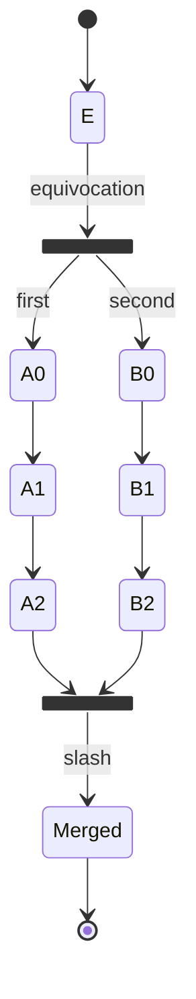
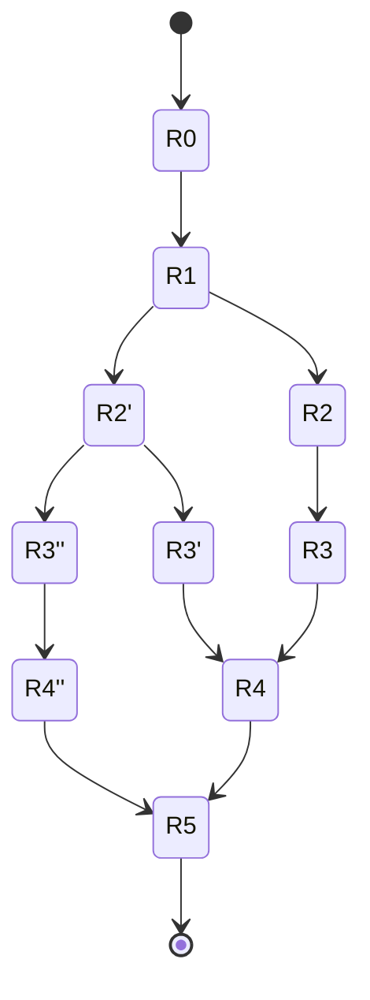

# Resource logic DAG

## Resource logic DAG

The resource logic structure is based on a concept of a _resource_, where particular resources have rules as to how they can be created & consumed along with logic to resolve any conflicts between duplicate consumptions (linearity violations) if applicable.

Resource types are defined by a particular `ResourceLogic`, which specifies under what conditions resources of that type can be created and consumed. 

```haskell=
data ResourceLogic = ResourceLogic {
  creationPredicate :: PhysicalDAG -> Transaction -> Bool,
  consumptionPredicate :: PhysicalDAG -> Transaction -> Bool,
}
```

- The `creationPredicate` describes under which conditions a resource can be created.
    - e.g. for credit: message from issuing user, or consumption of equal existing credit
- The `consumptionPredicate` describes under which conditions a resource can be consumed.
    - e.g. for credit: authorisation from owning user

A `Resource` is data owned by a particular resource logic. In order to allow for the rendering of a global content-addressed state, resources include a `prefix` and `suffix`, which can be combined together to form a `key`, and an arbitrary `value`.

```haskell=
data Resource = Resource {
  logic :: ByteString,
  prefix :: ByteString,
  suffix :: ByteString,
  data :: ByteString,
  value :: Natural
}
```

```haskell=
key :: Resource -> ByteString
key r = logic r <> domainSeparator <> prefix r <> domainSeparator <> suffix r
```

- The `logic` is a hash commitment to the set of creation and consumption predicates (as above) defining under what conditions the resource can be created and under what conditions the resource can be consumed.
- The `prefix` is an application-determined name component.
- The `suffix` is a key suffix used to distinguish between distinct-but-equal resources (e.g. same logic, same prefix, same value, but distinct suffix). Semantics of the `suffix` semantics are enforced by the resource logic (e.g. for application internal prefixing by resource owners, with suffixes addressing individual resources).
- The `data` is an arbitary bytestring which can be interpreted by the predicates (it could itself contain other predicates).
- The `value` is a natural number (non-negative integer). This resource logic model builds in a notion of fungibility, i.e. two resources with logic (and prefix) `l`, different suffixes, and values `a` and `b` are treated as equivalent to one resource with logic (and prefix) `l` and value `c` iff. `c = a + b`.

Resources can be created in a content-addressed way with the appropriate logic whenever `creationPredicate` is satisfied.

```haskell=
data Transaction = Transaction {
  created :: Set Resource,
  consumed :: Set Resource,
  extradata :: ByteString,
  finalityPredicate :: PhysicalDAG -> Transaction -> Bool
}
```

- The set of `created` resources are resources which this transaction creates.
- The set of `consumed` resources are resources which this transaction consumes.
- The `extradata` field is for additional data which may be meaningful to predicates in resource logics (e.g. signatures).
- The `finalityPredicate` determines whether a transaction is considered finalized. After the finality predicate is satisfied, resources consumed by this transaction are marked as having been consumed, and resources created by this transaction can be consumed in future transactions (assuming that their consumption predicates are satisfied).

> Additional context on finality predicates: a separate predicate is used here to provide a notion of atomicity at the level of individual transactions. Finality predicates may, for example, wait for confirmation by a consensus quorum, or select between transactions which consume the same resources according to some selection criterion. Two consumptions of the same resource are considered to possibly conflict only if both of their finality predicates are satisfied.

> TODO: Figure out more clearly what data predicates in resource logics have access to. Instead of passing the whole physical DAG / transaction data, can we instead rely on a local view of "messages" / resources sent & received? Want to rely on local invariants - and e.g. even stuff like consensus should be expressible as a resource which was previously created (and is then witnessed, but not consumed). 

A `Transaction` in a resource logic DAG simply consumes a (possibly empty) set of existing resources and creates a (possibly empty) set of new resources. Transactions are atomic, in that either the whole transaction is valid (and can be appended to / part of a valid resource logic DAG), or the transaction is not valid and cannot be appended to / included in the resource logic DAG. Transactions include an `extradata` field which can be read by the resource logic predicates and may contain signatures, proofs, etc.

Transactions are valid if and only if:
- all consumed resources were previously created by a transaction in the history, which was itself (recursively) valid, and whose `finalityPredicate` was satisfied
- the consumption predicates of all the resources consumed by the transaction are satisfied
- the creation predicates of all the resources created by the transaction are satisfied
- prefixes of any created resources are of the form `hash(logic)` for the resources created

A resource logic DAG is valid if and only if:
- all transactions are valid by these conditions
- all transactions are included in the same order as their data in the physical DAG

From a particular resource logic DAG, an observer can calculate a _state_ as a key-value mapping by taking `key(resource)` and `value(resource)` for all resources created but not yet consumed in the history of that DAG.

> Note: For a multihop atomic swap, the transaction needs to refer to a consensus provider for finality, or consensus providers, at which point conflict resolution might need to be done post-hoc. If my pre-transaction (a transaction before finality criteria are met, roughly equivalent to an intent) specifies that resources need to be considered final in respect to the CP I chose, we get atomicity without risking to need post-hoc conflict resolution.

> TODO: Work out how the taiga representation is a special case of this. Ask Joe if that maps to taigas "creating virtual resources" approach.

### Linearity

Many kinds of resources may like to encode a notion of _linearity_, in that resources of that kind should only be able to be consumed exactly once, and any instances of consumption more than once encountered in a history should be detectable and addressable with an associated notion of _conflict resolution_. For example, contemporary blockchain protocols typically require linearity for representing scarce fungible and non-fungible assets, and resolve conflicts by the decision of a particular consensus algorithm. 

- model enforces balance check in a transaction (w/encoded fungibility)
- model enforces recording of conflicts
- virtual resources created/destroyed in a single tx need not be recorded
- conflict resolution predicate encoded in consumption predicate - in order for resources created by a tx to be later consumed, conflicts in the history of that tx's resource graph must be resolved


#### Modeling non-linearity: virtual resources

- virtual resources are created & destroyed in a single tx, need not be recorded

### Handling conflicts

A conflict is for a linear resource created at one point `t_0` (logical time) in a resource logic DAG to be consumed at two points `t_1` and `t_1'`, both downstream of `t_0` but unordered with respect to each other, in valid transactions whose finality predicates are otherwise satisfied. Later on, when `t_1` and `t_1'` are both seen by a node computing the current state frontier of a logical DAG, the conflict is detected, and before further transactions are appended to the logical DAG, which reference both `t_1` and `t_1'`, some action must be taken to resolve the conflict.

Conflicts are detected by computing a unique nullifier for each resource, which is published when the resource is consumed. If the same nullifier is published twice in a history, this constitutes a conflict, and consumption predicates of resources in this application namespace can require that all conflicts in their namespace be resolved before those resources can be spent. Resolving conflicts might mean that some resources created on one or both sides of the conflict are rendered unspendable (meaning that their consumption predicates will never be satisfied). 

For example, suppose the case of a non-fungible token with a conflict resolution rule depending on local order of a particular consensus provider. The consumption predicate of that non-fungible token will require that all spends in its history be on the locally-first side of the ordering by the referenced consensus provider, so if a conflict is detected, the version of the NFT on the side which is locally-second will be unable to be spent in the future. 

Conflicts-by-resource-type
- conflict detection w/nullifiers
- somehow figure out the resource type
- keep a mapping of resource types to conflict y/n
- consumption predicates of resource types require conflict resolution of conflicts of their type
- conflict resolution can render some of the resources of that type unspendable

**CR rules determine linearizability of an application and should be checked for that by the compiler, if people write their own.**

Cases of CR:
- Resolved by some consensus provider (or ordered list of consensus providers)
    - Specified at the application level (which prefixes the namespace for resources)
- Credit (fungible) - resource-level
    - Let both sides of the double spend live, but broadcast double spend/violation of annouced credit issuance policy and track reputation/slash outher credit assets the originator holds
    - when a double spend is detected at the resource level, require a transaction before any transaction from a particular identity is considered valid, and potentially slash the resource type on one side or both sides of the double spend
- NFT - resource-level
    - vote on which side gets the real thing
    - one side of the double spend is marked unspendable (as if it had been spent) at CR time
    - Consumption predicate could enforce specific finality predicate, tying to the application, to make CR CP and finality CP be the same

Consumption predicates for linear resources will enforce that if a conflict (double-spend) conflict tracking state which must then be resolved before resources created downstream of either side of the conflict can be consumed.


(explain how conflict resolution predicate can be included in the consumption predicate)
(> TODO: which properties does a conflic resolution rule need to have and how do we verify/enforce them?
- deterministic 

How do CRs rules compose? Which types are composable, if they can contain different finality conditions, resolution approaches, etc. First approach: Require in an app, that the underlying apps CR rule is satisfied, in a specified hierarchy.

TODO <)

- The `conflictResolutionPredicate` describes what to do when the resource in question is spent more than once in a particular history. After a particular resource has been spent more than once, the `conflictResolutionPredicate` must be satisified by any history which builds on any of those spends (i.e. any transaction with transitive inputs including the "double-spend"). Once satisfied in a particular transaction, the conflict resolution rule does not need to be satisfied again for any of the histories built on the double-spent resource for this particular double-spend, but if another spent (of the same resource) is later detected, it will need to be satisfied agian.

It is important to note that the abstraction of an `Application` is "virtual" - applications are not "deployed" or tracked in any sort of registry - they are content-addressed by particular resources. An `Application` can be said to exist by virtue of the existence resources referencing it, and if those resources are completely consumed it no longer exists (except in history).

Applications can have "sub-applications", i.e. allow for their state to be consumed to create state with a different creation/consumption/conflict resolution predicate, without restriction.

> TODO QUESTION: in this framework, is `Consensus` an `Application`? 

(TODO ordering here)

---
## Conflict Resolution

There are several resons why conflicts can arise:

1. Linearity Violations (e.g. double spends, post-hoc equivocation of ancestral state)
2. Predicate non-fulfillment

For both of these types, conflict resolution rules can get shipped via predicates.
Conflict resolution rules are:
- Application specific
    - Each application (indicated by prefix) only uses one CR rule. This can be enforced by requiring the proof to record that a newly minted new  carries the same predicate as is predecessors. Since state resources are also separated by application prefix, no inconsistencies can happen with CR rule application and resource consumption.
    
The default CR rule is local order first.

### Example CR rule: Credit
If we assume an equivocation on ancestral state of E (Equivocator), who transacted A first and now issues transactions with B, re-using the same resources. (E, A, B could be Accounts or Consensus Providers, the semantics don't change, only the merge mechanism)
A and B (or the subnetworks they provide consensus for) now produce internal history which is inconsistent with the one in the other subnet.



One naive CR rule would be to slash all "bad state", in which case we would need to prune the all subtrees which have EQV state as an ancestor.
If we prefer to keep the histories, we can burn and remint credit stemming from the EQV (assume we are on the side of AX and BX is merged into our history). 

After the merge, the in addition to E credit, E' credit exists: A variety of rules on how to do pricing can be imagined, for different tradeoffs:
- 1:1 for all assets --> inflates E credit
- 0.5:1 for E' : E --> keeps value post merge equal, punishes E credit holders

Futher punishment, outside of slashing, can be executed towards E and should be voted upon by affected parties.

After AX and BX have both had the other side merged into their history, E, E'A and E'B will exist, which all are not fungible.

For every transaction of which not all downstream transactions are merged, we need to inform the recepients. There could e.g. be forced swaps before spending tainted assets, exchanging E proportionally for any E' (depending on height of branching?) to resolve. This could happend during a finality period as well.

> Note: For granular finality periods: Use an application specific consensus provider.

After finality, a message containing the conflicting subtrees, as well as the resolution is published, s.t. eventual consistency is achieved.

Users should be able to specify intentional "double-spends" in finality conditions, in case of submission to multiple solvers etc. 

### Example CR rule: NFT

In case of non-fungible assets, a vote needs to happen during finality, which one is the true transaction going forward. For high value transactions, one might want to wait for finality, and possibly do an atomic swap during a finality period or other escrow mechanism.

We care about modeling material scarcity of the underlying assets correctly. 


### Example CR rule: Deterministic PRF

If the network wants shared randomness, determistic given a seed, including replay of numbers, one way would be to set the CR rule to "None", enabling state resources to be repeatedly consumed.

Here R is a transaction containing the PRF in the predicate, with the content of the transaction being only dependent on the consumed previous state of it, RX == RX' == RX'' and merges being free.




## Consensus Providers
Have liveness, merge and conflict resolve conflicts on join of logical DAGs


