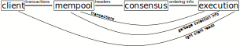

# Typhon

## Summary
Typhon stores, orders, and executes transactions on Anoma blockchains. 
It is intended as a replacement for [Tendermint](https://tendermint.com/core/).
[We have a brief overview presentation of some of the features of Typhon here.](https://youtu.be/n4MlYO_ls4M?t=7687).

Typhon can be broken down into (roughly) 3 layers: 
- a [mempool](typhon/mempool.md), which stores received transactions
- a [consensus](typhon/heterogeneous_paxos.md), which orders transactions stored by the mempool, and
- an [execution engine](typhon/execution.md), which executes the transactions on the state machine.

We expect each Anoma participant (*validator*) will run processes in all three layers.

Above, we use "client" to refer to matchmakers, ferveo, or anyone else who generates transactions to be ordered.
The "critical path" is shown in thicker arrows, with other crucial messages shown in narrower arrows.

## [Mempool](typhon/mempool.md)
Validators receive transactions from clients, store them, and make them available for the [execution engine](typhon/execution.md) to read. 
The mempool protocol, which is based on [Narwhal](https://arxiv.org/abs/2105.11827) also produces a [DAG](https://en.wikipedia.org/wiki/Directed_acyclic_graph) of *headers*, which reference batches of transactions (via hash), and prove that those transactions are available for the [execution engine](typhon/execution.md). 
These headers are ultimately what the [consensus](typhon/heterogeneous_paxos.md) decides on, in order to establish a total order of transactions.
[Read more here.](typhon/mempool.md)
## [Consensus](typhon/heterogeneous_paxos.md)
Our consensus is based on [Heterogeneous Paxos](https://arxiv.org/abs/2011.08253).
Validators choose a totally ordered sequence of headers from the [mempool](typhon/mempool.md) DAG.
This establishes a total order of transactions for the [execution engine](typhon/execution.md) to execute.
[Read more here.](typhon/heterogeneous_paxos.md)
## [Execution Engine](typhon/execution.md)
Given a total order of transactions, the [execution engine](typhon/execution.md) updates and stores the "current" state of the virtual machine, using as much concurrency as possible. 
Proofs from the execution engine allow light clients to read the current state.
When the execution engine has finished with a transaction, it communicates to the [mempool](typhon/mempool.md) that the transaction can be garbage-collected from storage. 
[Read more here.](typhon/execution.md)
